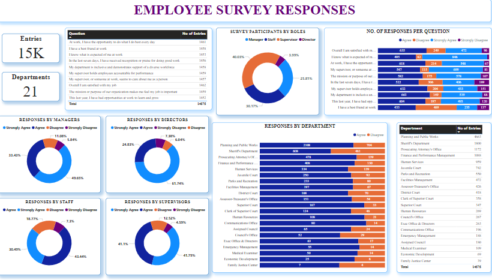

# Employee-Survey-Responses

## Introduction
The Employee Survey Responses are actual responses from an employee engagement survey conducted
by Pierce County WA and completed voluntarily by government employees. The dataset is a Single table
and contains 14,725 records. The total number of fields is 10.

## Problem Statement

1. Which survey questions did respondents agree with or disagree with most?

2. Do you see any patterns or trends by department or role?

3. As an employer, what steps might you take to improve employee satisfaction based on the survey
results?

## Skills Demonstrated

- Data cleaning, modeling, visualization
- Created a category group for every role using conditional formatting.

## Data Sourcing
Saved the link shared in the cohort group as an excel file and imported into power BI for analysis.

## Data Visualization

## Conclusions

1. Most Employees agree/strongly agree with the questions asked in the survey.

2. Planning and Public works, Sheriffs department, Prosecuting Attorney's Office and Finance and Performance Management Department had the highest number of entries.

3. Most employees have best friends at work.

